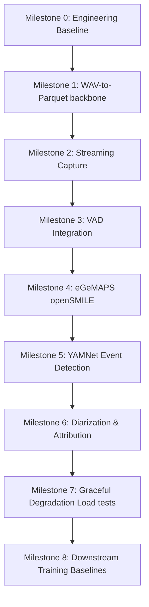

# 🎙️ Audio Pipeline & Acoustic Modeling (odu-audio)

This repository contains the architecture specification, data contracts, and implementation scaffold for the **Audio Processing & Acoustic Modeling Pipeline** (everything in the system before lexical interpretation).

The pipeline processes raw clinical audio recordings/streams, monitors audio quality, detects acoustic events (e.g., screams, cries), attributes speech to the patient versus clinicians or others, and extracts rich acoustic features (eGeMAPS and emotion2vec affect embeddings) saved in Parquet format.

> [!NOTE]
> **Current Repository Status**: This repository is a **fully functional, verified real-time streaming and offline audio feature extraction pipeline**. Milestones 1 through 4 have been successfully implemented, bringing complete VAD (Silero VAD v4) and eGeMAPS acoustic feature extraction to life with 103 passing tests and 91% line coverage.

---

## 🔍 What's Going On (Project Overview)

The primary goal of this repository is to build a robust audio processing system that transforms raw microphone input or audio files into structured acoustic feature windows. The main output of this system is `acoustic_features.parquet`, which serves as the direct upstream input to downstream lexical processing (ASR, transcriptions) and clinical analysis tools.

### Three Separate Systems
To maintain clean boundaries, prevent data leakage, and align with hardware limitations, the codebase is structured into three separate pipelines:

1. **Real-time Streaming Pipeline (`src/audio_pipeline/runtime/`)**
   - Processes live microphone streams in chunks (e.g., 30ms / 480 samples).
   - Designed for low-latency clinical sessions with active load management and graceful degradation.
2. **Offline Dataset Pipeline (`src/audio_pipeline/offline/`)**
   - Batch processes complete session recordings (e.g., `audio.wav`).
   - Optimizes feature extraction using multi-core/parallel workers and runs full post-hoc diarization for maximum accuracy.
3. **Model Training Pipeline (`training/` - Planned)**
   - Used for training and calibrating downstream acoustic models (e.g., LightGBM baselines).
   - Performs room noise, codec, and clipping simulations for data augmentation (which **never** run during streaming or offline inference).

### Branching Pipeline Flow
Rather than a simple linear pipeline, the audio data flows through a branching architecture. This is a critical design choice: **YAMNet event detection runs in parallel to VAD segmentation**, ensuring that non-speech distress events (such as screams, cries, or gasps) are captured even if they fall outside speech boundaries.

```
                    Raw Audio Input
                          │
          ┌───────────────┴───────────────┐
          ▼                               ▼
   Quality Monitor                 Event Detection
 (Full stream checks)           (YAMNet on full stream)
          │                               │
   Clipping, Dropout, SNR          Distress Events
          │
    VAD Segmentation (Silero)
          │
    Speaker Diarization (Pyannote) & Attribution (5 Methods)
          │
    Patient Speech Only (Filtering)
          │
    Acoustic Features (eGeMAPS, emotion2vec)
          │
          ▼
   acoustic_features.parquet
```

### Component-Specific Latency Targets
Instead of an unrealistic universal latency budget (e.g., <200ms), the pipeline operates with realistic, component-specific targets based on algorithmic requirements:

| Component | Target Latency | Rationale / Window Requirements |
|---|---|---|
| **Capture-to-buffer** | `<20 ms` | Hardware & OS buffer constraint |
| **Resampling** | `<5 ms` / chunk | Must process faster than real-time |
| **VAD Inference** | `<5 ms` / chunk | Silero VAD is <1ms on CPU |
| **VAD Preliminary** | `<50 ms` | Fast initial speech/silence determination |
| **VAD Stable Endpoint** | `250 - 500 ms` | Reliable speech segment edge |
| **Provisional Attribution** | `<500 ms` | Fast preliminary speaker ID |
| **YAMNet Event Detection** | `~1.0 - 1.5 s` | **Algorithmic constraint**: 0.96s native window + 0.48s hop |
| **emotion2vec Embedding** | `1.0 - 3.0 s` | **Window-dependent**: Requires context for affect representation |
| **Final Diarization** | Post-segment | Offline refinement, run batch diarization |

---

## 🛠️ What Has Been Done (Current State)

The project features a complete streaming capture, stateful preprocessing, and feature extraction implementation:

### 1. Implemented Components
The following modules are fully implemented inside `src/audio_pipeline/`:

* **`src/audio_pipeline/capture/`**:
  - `audio_chunk.py`: Metadata schema representing a captured block of raw audio.
  - `audio_source.py` / `microphone_source.py` / `file_source.py`: Real-time capture drivers for sound devices and file playback.
  - `ring_buffer.py` / `bounded_queue.py`: Thread-safe circular arrays and backpressure-managing queues.
* **`src/audio_pipeline/preprocessing/`**:
  - `streaming_resampler.py`: Resampler keeping overlapping buffer boundaries to eliminate transition clicks.
* **`src/audio_pipeline/segmentation/`**:
  - `vad_interface.py`: Interface for interchangeable VAD algorithms.
  - `silero_vad.py`: Core Silero VAD (v4) implementation executing on CPU.
  - `endpointer.py`: State machine converting probabilities to provisional/final speech boundaries.
* **`src/audio_pipeline/features/`**:
  - `feature_extractor.py`: Interface for high-level acoustic extractors.
  - `opensmile_extractor.py`: openSMILE driver for 88 eGeMAPSv02 functionals with ThreadPoolExecutor timeout protection.
  - `yamnet_detector.py`: YAMNet distress event detector using ONNX Runtime. Runs on the full audio stream (in parallel to VAD) to detect screams, crying, gasps, wheezes, and other distress sounds. Auto-downloads and caches the `yamnet.onnx` model and Audioset class map to `~/.cache/yamnet/`.
* **`src/audio_pipeline/speakers/`**:
  - `diarizer_interface.py`: Abstract `DiarizeriInterface` and `DiarizationResult` / `DiarizedTurn` schemas.
  - `dummy_diarizer.py`: Mock diarizer for deterministic offline testing (single speaker / overlap / no-speech modes).
  - `pyannote_diarizer.py`: Full pyannote.audio 3.x diarization backend accepting in-memory waveform tensors (requires HF token).
  - `enrollment.py`: `SessionEnrollment` — enrolls patient speaker embedding at session start, computes cosine similarity. Embeddings are in-memory only (never persisted).
  - `attribution.py`: `SpeakerAttributor` — 8-step decision logic; ambiguous/overlapping speech always produces `UNKNOWN`/`OVERLAP`, never forced `PATIENT`.
* **`src/audio_pipeline/schemas/`**:
  - `feature_record.py` / `speaker_attribution.py`: Validated data structures representing the streaming pipelines' output.

---

## 📈 What to Make (Implementation Roadmap)

Work proceeds through a vertical-slice approach where features are integrated and tested step-by-step. The implementation roadmap consists of **9 testable milestones** over a target timeline of 16 weeks.



* `[x]` **Milestone 0**: Engineering Baseline (Week 1)
* `[x]` **Milestone 1**: WAV-to-Parquet Backbone (Weeks 2-3)
* `[x]` **Milestone 2**: Streaming Capture & Ingestion (Weeks 4-5)
* `[x]` **Milestone 3**: VAD & Stable Endpointing (Week 6)
* `[x]` **Milestone 4**: eGeMAPS Feature Extraction (Week 7)
* `[x]` **Milestone 5**: YAMNet Event Detection (Weeks 8-9)
* `[x]` **Milestone 6**: Diarization & Attribution (Weeks 10-12)
* `[x]` **Milestone 7**: Graceful Degradation Validation (Week 13)
* `[ ]` **Milestone 8**: Training Pipeline Baselines (Weeks 14-16)

---

## 🚀 Getting Started

### 1. Environment Setup
Create a virtual environment (Python 3.10+ is required due to modern type annotations) and install the core requirements.

```bash
# Create and activate environment
conda create -n audio-pipeline python=3.10 -y
conda activate audio-pipeline

# Install locked dependencies
pip install -r requirements.txt

# Install packages from source repositories (required for specific components)
pip install git+https://github.com/snakers4/silero-vad.git
pip install git+https://github.com/ddlBoJack/emotion2vec.git
```

> [!NOTE]
> **HuggingFace Access**: Pyannote Diarization (integrated in later milestones) requires a HuggingFace account, acceptance of user terms at [pyannote/speaker-diarization](https://huggingface.co/pyannote/speaker-diarization), and setting your token:
> `export HF_TOKEN="your_huggingface_token_here"`

### 2. Verify Schema compilation
You can verify that the existing Python code compiles correctly without errors by running:

```bash
PYTHONPATH=. python3 -c "
from src.audio_pipeline.schemas.feature_record import AcousticFeatureRecord
from src.audio_pipeline.runtime.degradation import DegradationManager
print('Scaffold code imported successfully!')
"
```

---

## 🔒 Responsible Use & Limitations

### Acoustic Affect vs. Emotion
The pipeline integrates `emotion2vec` embeddings. It is critical to frame these correctly:
* **Acoustic Affect**: The model outputs acoustic affect embeddings (vocal arousal and valence patterns).
* **No Diagnostic State**: The system does **not** evaluate, classify, or diagnose a patient's internal emotional or psychiatric state.
* **Confounding Factors**: Vocal expressions of affect are highly variable and are affected by language, culture, physical illness, pain, medications, neurological differences (e.g. neurodivergence), age, and microphone hardware.

### Prohibited Uses
The models and features extracted in this pipeline **must not** be used for:
* Autonomous clinical diagnosis without expert human review.
* Suicide risk decisions or emergency dispatch decisions without human oversight.
* Health insurance coverage, treatment denial, or rationing decisions.
* Surveillance, staff disciplinary monitoring, or legal and immigration proceedings.

---

### License & Citations
* **openSMILE (eGeMAPS)**: Distributed under the audEERING research license. *Commercial use requires a separate license from audEERING.*
* **Silero VAD**: MIT License.
* **Pyannote Audio**: MIT License.
* **YAMNet**: Apache 2.0 License.
* **emotion2vec**: MIT License.
