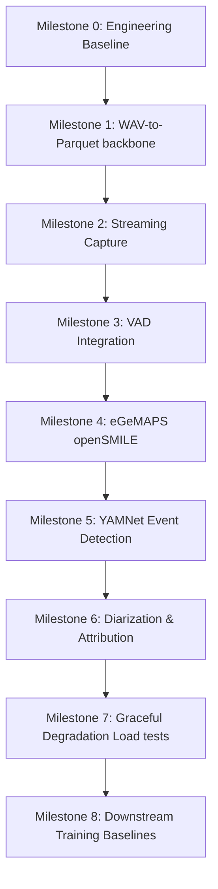

# 🎙️ Audio Pipeline & Acoustic Modeling (odu-audio)

This repository contains the architecture specification, data contracts, and implementation scaffold for the **Audio Processing & Acoustic Modeling Pipeline** (everything in the system before lexical interpretation).

The pipeline processes raw clinical audio recordings/streams, monitors audio quality, detects acoustic events (e.g., screams, cries), attributes speech to the patient versus clinicians or others, and extracts rich acoustic features (eGeMAPS and emotion2vec affect embeddings) saved in Parquet format.

> [!IMPORTANT]
> **Current Repository Status**: This repository is currently a **comprehensive architectural specification and code scaffold**. The core data schemas and the graceful degradation manager are implemented as syntactically valid code, but no audio processing, VAD, diarization, or feature extraction models have been integrated or run yet. No tests have been written or executed.

---

## 🔍 What's Going On (Project Overview)

The primary goal of this repository is to build a robust audio processing system that transforms raw microphone input or audio files into structured acoustic feature windows. The main output of this system is `acoustic_features.parquet`, which serves as the direct upstream input to downstream lexical processing (ASR, transcriptions) and clinical analysis tools.

### Three Separate Systems
To maintain clean boundaries, prevent data leakage, and align with hardware limitations, the codebase is structured into three separate pipelines:

1. **Real-time Streaming Pipeline (`src/audio_pipeline/runtime/`)**
   - Processes live microphone streams in chunks (e.g., 30ms).
   - Designed for low-latency clinical sessions with active load management and graceful degradation.
2. **Offline Dataset Pipeline (`src/audio_pipeline/offline/`)**
   - Batch processes complete session recordings (e.g., `audio.wav`).
   - Optimizes feature extraction using multi-core/parallel workers and runs full post-hoc diarization for maximum accuracy.
3. **Model Training Pipeline (`training/` - Planned)**
   - Used for training and calibrating downstream acoustic models (e.g., LightGBM baselines).
   - Performs room noise, codec, and clipping simulations for data augmentation (which **never** run during streaming or offline inference).

### Branching Pipeline Flow
Rather than a simple linear pipeline, the audio data flows through a branching architecture. This is a critical design choice: **YAMNet event detection runs in parallel to VAD segmentation**, ensuring that non-speech distress events (such as screams, cries, or gasps) are captured even if they fall outside speech boundaries.

```
                    Raw Audio Input
                          │
          ┌───────────────┴───────────────┐
          ▼                               ▼
   Quality Monitor                 Event Detection
 (Full stream checks)           (YAMNet on full stream)
          │                               │
   Clipping, Dropout, SNR          Distress Events
          │
    VAD Segmentation (Silero)
          │
    Speaker Diarization (Pyannote) & Attribution (5 Methods)
          │
    Patient Speech Only (Filtering)
          │
    Acoustic Features (eGeMAPS, emotion2vec)
          │
          ▼
   acoustic_features.parquet
```

### Component-Specific Latency Targets
Instead of an unrealistic universal latency budget (e.g., <200ms), the pipeline operates with realistic, component-specific targets based on algorithmic requirements:

| Component | Target Latency | Rationale / Window Requirements |
|---|---|---|
| **Capture-to-buffer** | `<20 ms` | Hardware & OS buffer constraint |
| **Resampling** | `<5 ms` / chunk | Must process faster than real-time |
| **VAD Inference** | `<5 ms` / chunk | Silero VAD is <1ms on CPU |
| **VAD Preliminary** | `<50 ms` | Fast initial speech/silence determination |
| **VAD Stable Endpoint** | `250 - 500 ms` | Reliable speech segment edge |
| **Provisional Attribution** | `<500 ms` | Fast preliminary speaker ID |
| **YAMNet Event Detection** | `~1.0 - 1.5 s` | **Algorithmic constraint**: 0.96s native window + 0.48s hop |
| **emotion2vec Embedding** | `1.0 - 3.0 s` | **Window-dependent**: Requires context for affect representation |
| **Final Diarization** | Post-segment | Offline refinement, run batch diarization |

---

## 🛠️ What Has Been Done (Current State)

The project stands as a fully reviewed architecture specification with an implemented code scaffold for data contracts and runtime load management.

### 1. Implemented Code Scaffold (Syntactically Valid, Untested)
The following code files are implemented inside `src/audio_pipeline/`:

* **`src/audio_pipeline/schemas/feature_record.py`**:
  - Defines `AcousticFeatureRecord` which holds temporal boundaries, speaker attribution, VAD metrics, 88-dimension eGeMAPSv02 features, YAMNet event scores, emotion2vec embeddings, and quality status.
  - Defines `DropReason` which records details of dropped/degraded windows.
* **`src/audio_pipeline/schemas/speaker_attribution.py`**:
  - Defines `SpeakerAttribution` which tracks speaker IDs, patient probability, attribution method, and overlap flags.
  - Implements `EnrollmentConfig` representing configuration for the 5 patient attribution methods.
* **`src/audio_pipeline/runtime/degradation.py`**:
  - Implements the `DegradationManager` which monitors processing latency (95th percentile) and degrades component execution deterministically across 6 levels under backpressure load.

> [!WARNING]
> **Import Failure Note**: Attempting to import the root package (e.g., `import src.audio_pipeline`) will currently fail with a `ModuleNotFoundError: No module named 'src.audio_pipeline.pipeline'`. This is because the orchestration file `pipeline.py` and other modules are currently stubs or empty folders, but are referenced in `src/audio_pipeline/__init__.py`. 
> 
> To inspect or work with the existing schemas/logic during Milestone 0, import directly from the subfiles:
> ```python
> # Direct imports bypass the __init__.py stubs:
> from src.audio_pipeline.schemas.feature_record import AcousticFeatureRecord
> from src.audio_pipeline.runtime.degradation import DegradationManager
> ```

### 2. Complete File Inventory
Here is the actual state of the files in the repository:

```
odu-audio/
├── ARCHITECTURE.md             # Design decisions & details
├── CONTRACTS.md                # Data contracts (v0.1-provisional)
├── DELIVERY_SUMMARY.md         # Deliverables overview
├── FILE_INVENTORY.md           # Manifest of repo files
├── FINAL_STATUS.md             # Phase status & verification checklist
├── IMPLEMENTATION_CHECKLIST.md # Checklists for tracking work
├── IMPLEMENTATION_ROADMAP.md   # Detailed milestone definition
├── NEXT_ACTIONS.md             # Commands to check repo syntax/imports
├── PERSON1_SUMMARY.md          # Change logs and rationales
├── PROJECT_OVERVIEW.md         # Visual markdown overview
├── QUICKSTART.md               # Code examples & guide
├── README.md                   # This file
├── START_HERE.md               # Interactive doc link index
├── TASKS.md                    # Original 16-week project backlog
├── requirements.txt            # Locked requirements
├── configs/
│   └── streaming_default.yaml  # Default yaml config template
├── model_cards/
│   ├── TEMPLATE.yaml           # Model card yaml template
│   └── emotion2vec.yaml        # Completed model card for emotion2vec
└── src/audio_pipeline/         # Python package source
    ├── __init__.py             # Entry point (contains stubs)
    ├── capture/                # (Empty) Audio recording
    ├── features/               # (Empty) feature extraction code
    ├── offline/                # (Empty) dataset generation
    ├── privacy/                # (Empty) anonymization checks
    ├── quality/                # (Empty) clipping/SNR checks
    ├── runtime/
    │   └── degradation.py      # Graceful degradation logic
    ├── schemas/
    │   ├── feature_record.py   # Output data contracts
    │   └── speaker_attribution.py # Speaker identity structures
    ├── segmentation/           # (Empty) VAD & Silero integration
    ├── speakers/               # (Empty) Pyannote diarization stubs
    └── storage/                # (Empty) Parquet storage writer
```

---

## 📈 What to Make (Implementation Roadmap)

Work must proceed through a vertical-slice approach where features are integrated and tested step-by-step. The implementation roadmap consists of **9 testable milestones** over a target timeline of 16 weeks.



### 1. Milestone 0: Engineering Baseline (Target: Week 1)
Establish the testing framework, static analysis tooling, and freeze the data contracts.
* **Tasks**:
  1. Set up project configuration files (`pyproject.toml` or `pytest.ini`, `mypy.ini`).
  2. Configure static analysis (`black`, `ruff`, `mypy`, `pytest`).
  3. Write mock/unit tests for existing schemas (`feature_record.py`, `speaker_attribution.py`) and degradation transitions (`degradation.py`).
  4. Correct the stub imports in `src/audio_pipeline/__init__.py` to allow clean importing.
  5. Setup a basic CI pipeline configuration (e.g. Github Actions).
  6. Approve `CONTRACTS.md` as `v0.1-provisional` following stakeholder sign-off.
* **Exit Criteria**: CI pipeline compiles code, runs static analysis, and achieves $\ge 80\%$ line coverage on the implemented scaffold.

### 2. Milestone 1: WAV-to-Parquet Backbone (Target: Weeks 2-3)
Build a functioning CLI utility that reads raw `.wav` audio, calculates basic quality metrics (clipping, dropout, estimated SNR), and saves output rows to a Parquet file.
* **CLI Command**:
  ```bash
  audio-pipeline wav-to-parquet --input input.wav --output output.parquet --config configs/streaming_default.yaml
  ```
* **Tasks**:
  1. Choose and configure the audio file loader (`soundfile` and `librosa`).
  2. Implement quality monitors (`src/audio_pipeline/quality/`): clipping ratio, dropout ratio, and basic SNR estimation.
  3. Implement the Parquet writer (`src/audio_pipeline/storage/parquet_writer.py`) with atomic file writes and schema versioning.
  4. Write $40+$ acceptance tests checking edge cases (various sample rates, bit depths, corrupt files, clipping levels).
* **Exit Criteria**: Command-line converter works, produces verified Parquet files, and matches golden fixtures. Stabilize contracts to `v1.0`.

### 3. Future Milestones (Weeks 4-16)
* **Milestone 2**: Streaming capture infrastructure (microphone I/O, ring buffer, resampling to 16 kHz in <20ms).
* **Milestone 3**: Integrate Silero VAD (Preliminary speech determination in <50ms, stable endpointing in 250-500ms).
* **Milestone 4**: openSMILE eGeMAPSv02 extraction (88 acoustic functionals on voiced segments).
* **Milestone 5**: YAMNet integration on full audio stream (detect cries, screams, distress parallel to VAD).
* **Milestone 6**: Diarization (Pyannote) & speaker attribution (5 enrollment options).
* **Milestone 7**: Graceful degradation validation under simulated high CPU/memory load.
* **Milestone 8**: Training pipeline (room noise & codec augmentations, downstream LightGBM baseline).

---

## 🚀 Getting Started

### 1. Environment Setup
Create a virtual environment (Python 3.10+ is required due to modern type annotations) and install the core requirements.

```bash
# Create and activate environment
conda create -n audio-pipeline python=3.10 -y
conda activate audio-pipeline

# Install locked dependencies
pip install -r requirements.txt

# Install packages from source repositories (required for specific components)
pip install git+https://github.com/snakers4/silero-vad.git
pip install git+https://github.com/ddlBoJack/emotion2vec.git
```

> [!NOTE]
> **HuggingFace Access**: Pyannote Diarization (integrated in later milestones) requires a HuggingFace account, acceptance of user terms at [pyannote/speaker-diarization](https://huggingface.co/pyannote/speaker-diarization), and setting your token:
> `export HF_TOKEN="your_huggingface_token_here"`

### 2. Verify Schema compilation
You can verify that the existing Python code compiles correctly without errors by running:

```bash
PYTHONPATH=. python3 -c "
from src.audio_pipeline.schemas.feature_record import AcousticFeatureRecord
from src.audio_pipeline.runtime.degradation import DegradationManager
print('Scaffold code imported successfully!')
"
```

---

## 🔒 Responsible Use & Limitations

### Acoustic Affect vs. Emotion
The pipeline integrates `emotion2vec` embeddings. It is critical to frame these correctly:
* **Acoustic Affect**: The model outputs acoustic affect embeddings (vocal arousal and valence patterns).
* **No Diagnostic State**: The system does **not** evaluate, classify, or diagnose a patient's internal emotional or psychiatric state.
* **Confounding Factors**: Vocal expressions of affect are highly variable and are affected by language, culture, physical illness, pain, medications, neurological differences (e.g. neurodivergence), age, and microphone hardware.

### Prohibited Uses
The models and features extracted in this pipeline **must not** be used for:
* Autonomous clinical diagnosis without expert human review.
* Suicide risk decisions or emergency dispatch decisions without human oversight.
* Health insurance coverage, treatment denial, or rationing decisions.
* Surveillance, staff disciplinary monitoring, or legal and immigration proceedings.

---

### License & Citations
* **openSMILE (eGeMAPS)**: Distributed under the audEERING research license. *Commercial use requires a separate license from audEERING.*
* **Silero VAD**: MIT License.
* **Pyannote Audio**: MIT License.
* **YAMNet**: Apache 2.0 License.
* **emotion2vec**: MIT License.
